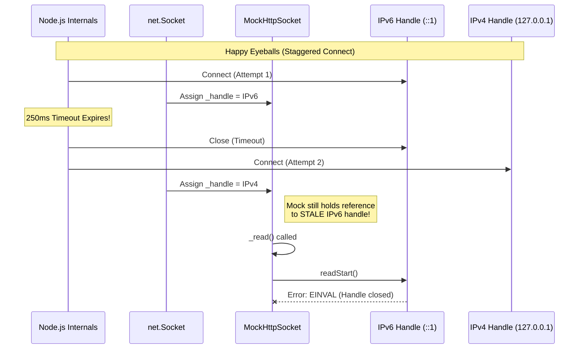

# @mswjs/interceptors EINVAL/ECANCELED reproduction and fix

This is a fork of `@mswjs/interceptors` and is an attempt to explain/solve https://github.com/mswjs/interceptors/issues/753.

---

Background: At my job, we use `nock` in our Node.js test suites to mock external HTTP calls. Nock works by intercepting the built-in Node.js `http` library and allows you to spy on outgoing requests and/or stub out their responses. Nock can be configured either to allow real outbound traffic for unmatched patterns, or to block outbound traffic and to treat any network activity that isn't "covered" as a test failure.

We also subscribe to [Datadog CI Visibility](https://docs.datadoghq.com/continuous_integration/) (via the [dd-trace-js](https://github.com/datadog/dd-trace-js) npm package) to monitor and improve our CI pipelines and test suites. This means while tests are running, telemetry is being collected and submitted to a Datadog ingestion endpoint.

The trouble started when we upgraded from `nock@13` to `nock@14` (and also `nock@15.0.0-beta6`). We immediately started experiencing strange `EINVAL`, `ECANCELED`, out of memory errors. We use Disabling this made the errors disappear, but we really want to continue using the CI Visibility product so I started to investigate.

I spent a long time chasing my tail, pursuing the idea that Datadog's heavy monkey-patching + instrumentation was conflicting with the new `interceptors`. I finally figured out that the bad behavior was caused by simply making a large number of real, unmocked HTTP requests while `nock` was loaded and activated in-process. Turns out `dd-trace-js` was just a good load test to expose the issue, rather than being a contributing factor.

Ultimately I made two major discoveries:

## Preventing `_read` from being forwarded from the `MockSocket` to its superclass `net.Socket` resolves the issue.

In https://github.com/mswjs/interceptors/pull/706 `MockSocket` was changed to expose the underlying `_handle` of a real socket. That PR solved some memory/resource leaks, by coercing the Node runtime not to make certain calls that subscribed event listeners based on some branching logic that depends on whether `_handle` is defined. Reverting https://github.com/mswjs/interceptors/pull/706 fixed my issue, but brought back the resource leak.

_(I'll be honest, I'm in over my head at this point, I don't really know socket programming or even Node's public socket API all that well. I'm just trying to make fix my CI jobs after a dependency upgrade. I could stop here and declare victory but I really didn't feel comfortable not understanding what's happening.)_

## The investigation

... todo write this

## Happy eyeballs

... todo write this

## usage of AI/LLM disclaimer

_The majority of this repo was directly generated by either OpenAI Codex, Claude Sonnet 4.5 or Gemini Pro 3. This work spanned a few weeks and several dozen discussions and agent interactions to reason through the problem, analyze logs, run tests, write code, and write documentation. The vast majority of the written content and code is machine-generated. Up to this point in the README has been was written by [me](https://github.com/jbinto), but after this point, it's :robot: all the way down._

---

**LLM generated content follows**

---

## The Bug

**Symptom:** `Error: EINVAL: invalid argument, read`
**Conditions:** High concurrency (200+ requests) + `dd-trace` + macOS (or environments where IPv6 is preferred but fails over to IPv4).

### Root Cause: Happy Eyeballs Race Condition

Node.js implements the "Happy Eyeballs" algorithm (RFC 8305) to connect to dual-stack hosts (`localhost`):

1.  It tries IPv6 (`::1`) first.
2.  If it doesn't connect within 250ms, it starts an IPv4 (`127.0.0.1`) connection attempt.
3.  Whichever connects first "wins"; the other is closed.

**The Race:**

1.  `MockHttpSocket` (in `passthrough` mode) shadows the socket's `_handle` property.
2.  Node.js starts with the IPv6 handle.
3.  The 250ms timeout fires (simulated or real latency). Node.js **closes the IPv6 handle** and swaps in a new IPv4 handle on the `net.Socket`.
4.  `MockHttpSocket` **still holds a reference to the stale, closed IPv6 handle**.
5.  `MockHttpSocket` calls `super._read()`, which calls `this._handle.readStart()`.
6.  Calling `readStart()` on a closed handle throws `EINVAL`.



## The Fix

In `passthrough` mode, `MockHttpSocket` should **not** attempt to read from the handle. It should delegate entirely to the `originalSocket` (the real network socket), which manages its own handle lifecycle correctly.

**Diff:**

```typescript
  public _read(size: number): void {
+   if (this.socketState === 'passthrough') {
+     return
+   }
+
    super._read(size)
  }
```

This prevents `MockHttpSocket` from touching the stale handle, eliminating the crash. Data flow is already handled by `originalSocket.pipe(this)`.

## Reproduction

This repo simulates the network conditions (latency) required to trigger the Happy Eyeballs timeout reliably.

```bash
# Clone and setup
git clone https://github.com/jbinto/msw-interceptors-einval-repro.git
cd msw-interceptors-einval-repro
pnpm install
pnpm build

# Setup repro
cd repro
pnpm install

# Test locally (macOS will show the bug)
pnpm test:baseline          # ❌ Should FAIL with EINVAL on macOS
pnpm test:fix               # ✅ Should PASS
```

## Docker Reproduction

Reproducing this in Docker requires some additional setup, but is essentially guaranteed to reproduce the issue.

**Prerequisites:**

- **Enable IPv6:** You must enable Dual Stack (IPv6) support in Docker for Mac.
  - **Docker Desktop:** Go to Settings -> Resources -> Network. Set "Default networking mode" to "Dual IPv4/IPv6". Set "Inhibit DNS resolution for IPv4 / IPv6" to "No filtering".

**The `repro-docker.sh` script:**
This script sets up a container with `tc` (Traffic Control) to inject a random delay (50ms - 500ms) on the loopback interface. This artificial latency forces the Happy Eyeballs algorithm to hit the 250ms timeout and trigger the handle swap, reliably reproducing the crash.

```bash
# 1. Build the image
docker build -t msw-repro .

# 2. Run the reproduction (requires NET_ADMIN capability for tc)
docker run --rm --cap-add=NET_ADMIN \
  -v $(pwd)/repro/repro-docker.sh:/workspace/repro/repro-docker.sh \
  msw-repro \
  bash repro-docker.sh
```
